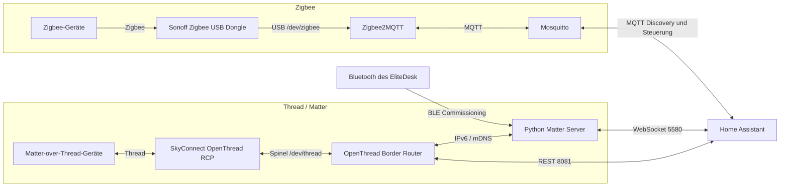

# Zigbee-, Thread- und Matter-Stack für Home Assistant Container

## Einordnung

Diese Dokumentation beschreibt den aktuell funktionierenden Smart-Home-Funkstack auf dem HP EliteDesk Docker-Host.

Home Assistant läuft als Container. Zigbee und Thread werden über zwei getrennte USB-Funkkoordinatoren bereitgestellt. Matter-over-Thread-Geräte werden über einen eigenständig betriebenen OpenThread Border Router und Python Matter Server in Home Assistant eingebunden.

Der Betrieb des Matter Servers als separater Docker-Container ist eine fortgeschrittene und von Home Assistant nicht offiziell unterstützte Installationsvariante. Sie funktioniert im dokumentierten Setup, erfordert jedoch eigenständige Pflege und Fehlersuche.

---

## Ziel

- bestehende Zigbee-Geräte weiterhin nutzen
- Zigbee und Thread parallel betreiben
- den vorhandenen SkyConnect nachhaltig weiterverwenden
- Matter-over-Thread-Geräte lokal und ohne Hersteller-Hub einbinden
- Home Assistant weiterhin als Docker-Container betreiben
- reproduzierbare Diagnose- und Wiederherstellungswege dokumentieren

---

## Aktueller Stand

- Zigbee2MQTT-Frontend-Port: `8090`
- Thread Border Router: OpenThread Border Router, gepinnt auf `openthread/border-router:sha-9f62a5d`
- Infrastruktur-Interface: `eno1`
- Thread-Interface: `wpan0`
- Matter-Server-Port: `5580`
- OTBR-Web-Port: `8080`
- OTBR-REST-Port: `8081`
- OTBR-Log-Level: `5`
- Docker-Logging für neu erstellte Container: `local` mit Rotation

---

## Architektur



---

## Zentrale Designentscheidung

Zigbee und Thread verwenden jeweils einen eigenen Funkadapter:

| Protokoll | Adapter | Zuständiger Dienst |
|---|---|---|
| Zigbee | Sonoff Zigbee 3.0 USB Dongle Plus | Zigbee2MQTT |
| Thread | SkyConnect mit OpenThread-RCP-Firmware | OTBR |
| Matter | kein eigener Funkadapter | Python Matter Server über IP und BLE |

Diese Trennung vermeidet Multiprotokoll-Abhängigkeiten und macht die Zuständigkeiten eindeutig.

---

## Relevante Pfade

```text
/opt/docker/homeassistant/
├── compose.yml
├── zigbee2mqtt/
│   └── data/
│       └── configuration.yaml
├── mosquitto/
│   ├── config/
│   ├── data/
│   └── log/
├── otbr/
│   └── data/
└── matter/
    ├── data/
    └── commission-thread-device.sh
```

---

## Stabile USB-Pfade

Dynamische Gerätenamen wie `/dev/ttyUSB0` und `/dev/ttyUSB1` können sich nach einem Neustart ändern.

Daher werden auf dem Host die stabilen Pfade unter `/dev/serial/by-id/` verwendet und im Container auf feste, lesbare Gerätenamen gemappt:

```yaml
devices:
  - /dev/serial/by-id/<SONOFF_BY_ID>:/dev/zigbee
```

```yaml
devices:
  - /dev/serial/by-id/<SKYCONNECT_BY_ID>:/dev/thread
```

Prüfung:

```bash
ls -l /dev/serial/by-id/
```

---

## Docker-Compose

Ein bereinigtes Beispiel befindet sich unter:

[`examples/compose.zigbee-thread-matter.yml`](../../examples/compose.zigbee-thread-matter.yml)

### Zigbee2MQTT

```yaml
zigbee2mqtt:
  image: koenkk/zigbee2mqtt:latest
  container_name: zigbee2mqtt
  restart: unless-stopped
  network_mode: host
  volumes:
    - /opt/docker/homeassistant/zigbee2mqtt/data:/app/data
  devices:
    - /dev/serial/by-id/<SONOFF_BY_ID>:/dev/zigbee
  environment:
    TZ: Europe/Berlin
```

Die zugehörige Konfiguration verwendet:

```yaml
serial:
  port: /dev/zigbee
  adapter: zstack
```
Das Zigbee2MQTT-Frontend läuft aufgrund von `network_mode: host` direkt auf dem Docker-Host. Ein Reverse Proxy über Nginx Proxy Manager ist im aktuellen Setup nicht erforderlich.

Da OTBR seine Weboberfläche ebenfalls auf Port `8080` startet, verwendet Zigbee2MQTT dauerhaft Port `8090`:

```yaml
frontend:
  enabled: true
  port: 8090
```
Lokaler Test:

```
curl -I http://127.0.0.1:8090/
```

Aufruf aus dem LAN:

```
http://<ELITEDESK-IP>:8090
```

Falls UFW aktiv ist, muss der Port ausschließlich für das benötigte LAN freigegeben werden, z. B.:

```
sudo ufw allow from <LAN-CIDR> \
  to any port 8090 proto tcp \
  comment 'Zigbee2MQTT frontend'
  ```

Die Trennung der Ports ist wichtig, weil sowohl Zigbee2MQTT als auch OTBR mit network_mode: host laufen und deshalb direkt um Host-Ports konkurrieren.

### Mosquitto

```yaml
mosquitto:
  image: eclipse-mosquitto:latest
  container_name: mosquitto
  restart: unless-stopped
  network_mode: host
  volumes:
    - /opt/docker/homeassistant/mosquitto/config:/mosquitto/config
    - /opt/docker/homeassistant/mosquitto/data:/mosquitto/data
    - /opt/docker/homeassistant/mosquitto/log:/mosquitto/log
```

Zigbee2MQTT enthält keinen eingebetteten MQTT-Broker. Ein externer Broker ist erforderlich.

### OpenThread Border Router

```yaml
otbr:
  image: openthread/border-router:sha-9f62a5d
  container_name: otbr
  restart: unless-stopped
  network_mode: host
  privileged: true
  cap_add:
    - NET_ADMIN
    - SYS_ADMIN
  devices:
    - /dev/serial/by-id/<SKYCONNECT_BY_ID>:/dev/thread
    - /dev/net/tun:/dev/net/tun
  environment:
    OT_RCP_DEVICE: "spinel+hdlc+uart:///dev/thread?uart-baudrate=460800&uart-flow-control"
    OT_INFRA_IF: "eno1"
    OT_THREAD_IF: "wpan0"
    OT_LOG_LEVEL: "5"
    OT_VENDOR_NAME: "Nabu Casa"
    OT_VENDOR_MODEL: "SkyConnect"
  volumes:
    - /opt/docker/homeassistant/otbr/data:/data
```

Wichtig:

- Das aktuelle Image wertet `OT_RCP_DEVICE`, `OT_INFRA_IF` und `OT_THREAD_IF` aus.
- `OTBR_AGENT_OPTS` war im getesteten Image wirkungslos.
- Der SkyConnect verwendet im funktionierenden Setup `460800` Baud mit Hardware-Flow-Control.
- `network_mode: host` ist für IPv6, mDNS und die lokale REST-Anbindung relevant.
- Das getestete und funktionierende Image ist aktuell auf `sha-9f62a5d` gepinnt.
- Der frühere Build `9f40147` beendete den `otbr-agent` bei einem Fehler während der Initialisierung des IPv6-Multicast-Routings. Der neuere Build versucht die Initialisierung erneut und verhindert damit eine permanente Container-/Agent-Restart-Schleife.
- `OT_LOG_LEVEL=5` reicht für den normalen Betrieb aus. `7` erzeugt sehr umfangreiche Debug-Ausgaben und sollte nur temporär zur Fehlersuche verwendet werden.
- Die OTBR-Weboberfläche verwendet Port `8080`, die REST-API Port `8081`.
  
### Python Matter Server

```yaml
matter-server:
  image: ghcr.io/matter-js/python-matter-server:stable
  container_name: matter-server
  restart: unless-stopped
  network_mode: host
  depends_on:
    otbr:
      condition: service_started
  security_opt:
    - apparmor:unconfined
  volumes:
    - /opt/docker/homeassistant/matter/data:/data
    - /run/dbus:/run/dbus:ro
  command: >-
    --storage-path /data
    --paa-root-cert-dir /data/credentials
    --primary-interface eno1
    --bluetooth-adapter 0
    --port 5580
```

Wichtig:

- `service_healthy` darf nur verwendet werden, wenn OTBR auch einen Healthcheck besitzt.
- `--bluetooth-adapter 0` aktiviert serverseitiges BLE-Commissioning.
- `/run/dbus` stellt dem Container Zugriff auf BlueZ bereit.
- Der Server verwendet `eno1` für link-lokale IPv6-Kommunikation.

---
## Host-Voraussetzungen für OTBR

OTBR benötigt auf dem Docker-Host funktionierendes IPv6-Forwarding und Router-Advertisement-Verarbeitung auf dem Infrastruktur-Interface.

Im aktuellen Setup werden dafür zwei persistente Sysctl-Dateien verwendet.

`/etc/sysctl.d/60-otbr-ip-forward.conf`:

```text
net.ipv6.conf.all.forwarding = 1
net.ipv4.ip_forward = 1
etc/sysctl.d/60-otbr-accept-ra.conf:
net.ipv6.conf.eno1.accept_ra = 2
net.ipv6.conf.eno1.accept_ra_rt_info_max_plen = 64
```
Aktivieren:

```
sudo sysctl --system
```
Prüfen:
```
sysctl \
  net.ipv4.ip_forward \
  net.ipv6.conf.all.forwarding \
  net.ipv6.conf.eno1.forwarding \
  net.ipv6.conf.eno1.accept_ra \
  net.ipv6.conf.eno1.accept_ra_rt_info_max_plen
```
Erwartet werden unter anderem:
```
net.ipv4.ip_forward = 1
net.ipv6.conf.all.forwarding = 1
net.ipv6.conf.eno1.forwarding = 1
net.ipv6.conf.eno1.accept_ra = 2
net.ipv6.conf.eno1.accept_ra_rt_info_max_plen = 64
```

accept_ra=2 ist absichtlich gesetzt: Router Advertisements sollen auf eno1 weiterhin akzeptiert werden, obwohl IPv6-Forwarding aktiv ist.

---
## Home-Assistant-Integrationen

### MQTT

Broker:

```text
Host: 127.0.0.1 oder IP des Docker-Hosts
Port: 1883
```

Wenn die Home-Assistant-Oberfläche Host und Port getrennt abfragt, wird im Host-Feld kein `mqtt://` eingetragen.

### OpenThread Border Router

REST-URL:

```text
http://127.0.0.1:8081
```

### Matter

WebSocket-URL:

```text
ws://127.0.0.1:5580/ws
```

### Thread

Nach dem Hinzufügen des OTBR erscheint der Border Router in der Thread-Integration. Das aktive Thread-Netzwerk muss ein bekanntes Dataset besitzen und als bevorzugtes Netzwerk markiert sein.

Das aktive Dataset ist ein Geheimnis und darf nicht ins Repository.

---

## Matter-over-Thread-Geräte provisionieren

### Standardweg

Home Assistant bevorzugt das Commissioning über die Companion-App auf einem regulären Android- oder iOS-Gerät.

### Dokumentierter Alternativweg

Im vorliegenden Setup schlug das mobile Commissioning unter GrapheneOS im vertraulichen Profil fehl. Die Google-Matter-Oberfläche meldete trotz bestehender WLAN-Verbindung „kein WLAN“.

Daher erfolgt das Commissioning direkt über den Matter Server und den Bluetooth-Adapter des EliteDesk:

```bash
cd /opt/docker/homeassistant/matter
./commission-thread-device.sh
```

Das Skript:

1. liest das aktive Thread-Dataset aus OTBR
2. fragt den Matter-Einrichtungscode verdeckt ab
3. hinterlegt das Dataset im Matter Server
4. startet `commission_with_code`
5. nutzt Bluetooth des EliteDesk zur Ersteinrichtung
6. überträgt die Thread-Zugangsdaten an das Gerät

Der numerische Code kann mit oder ohne Bindestriche eingegeben werden. Er wird nicht gespeichert.

---

## Betriebsprüfungen

### Container

```bash
docker ps --filter name=zigbee2mqtt
docker ps --filter name=mosquitto
docker ps --filter name=otbr
docker ps --filter name=matter-server
```

### Zigbee2MQTT

```bash
docker logs --tail=100 zigbee2mqtt
```

Erwartete Kernmeldungen:

```text
Connected to MQTT server
Coordinator firmware version
Zigbee2MQTT started
```
Frontend prüfen:

```bash
ss -ltnp | grep ':8090'
curl -I http://127.0.0.1:8090/
```

Bei network_mode: host lauscht Zigbee2MQTT direkt auf dem Host. Ein fehlender Zugriff aus dem LAN kann daher auch durch UFW verursacht werden.

---

### Mosquitto

```bash
ss -ltnp | grep ':1883'
```

Test:

```bash
mosquitto_sub -h 127.0.0.1 -t test -v
mosquitto_pub -h 127.0.0.1 -t test -m hello
```

### OTBR

```bash
docker exec otbr ot-ctl state
docker exec otbr ot-ctl dataset active -x
curl -sS http://127.0.0.1:8081/node
```

Erwartet:

```text
leader
```

oder bei mehreren Border Routern ein anderer aktiver Thread-Zustand.

Thread-Zustand:

```bash
docker exec otbr ot-ctl state
```
Erwartet:
```
leader
Done
```
Bei mehreren Border Routern kann auch ein anderer aktiver Thread-Zustand korrekt sein.

REST-API:
```
curl -sS http://127.0.0.1:8081/node
```
Das JSON sollte einen aktiven Zustand enthalten, beispielsweise:
```
"state": "leader"
```
IPv6-Multicast-Routing:
```
cat /proc/net/ip6_mr_vif
```
Im funktionierenden Setup erscheinen mindestens:
```
wpan0
eno1
```
Interface-Index des Thread-Interfaces prüfen:
```
cat /sys/class/net/wpan0/ifindex
```
OTBR-Fehler der letzten Minuten:
```
docker logs --since 2m otbr 2>&1 \
  | grep -E 'McastRtMgr|InitMulticastRouterSock|exited with code' \
  || echo "OTBR: keine Multicast-/Crashfehler"
```
Ein stabiler Betrieb ist gegeben, wenn der Agent aktiv bleibt, ot-ctl state einen aktiven Zustand meldet und wpan0 sowie eno1 in /proc/net/ip6_mr_vif registriert sind.

Eine zusätzliche positive Meldung ist:
```
Backbone Router becomes Primary!
```
---
### Matter Server

```bash
ss -ltnp | grep ':5580'
docker logs --tail=100 matter-server
```

Erwartet:

```text
Matter Server successfully initialized
```

### Bluetooth

```bash
bluetoothctl show
rfkill list bluetooth
docker exec matter-server test -S /run/dbus/system_bus_socket
```

---

## Backup

Vor Änderungen sichern:

```bash
cd /opt/docker/homeassistant

sudo tar -czf \
  backup-zigbee-thread-matter-$(date +%F).tar.gz \
  zigbee2mqtt/data \
  mosquitto/config \
  otbr/data \
  matter/data \
  compose.yml
```

Das Backup enthält sensible Daten und darf nicht veröffentlicht werden.

---

## Sicherheits- und Hardening-Hinweise

- Mosquitto sollte langfristig nicht anonym im gesamten LAN betrieben werden.
- UFW-Regeln nur für tatsächlich benötigte Quellnetze öffnen.
- Die Zigbee2MQTT-Weboberfläche optional mit `auth_token` schützen.
- Thread-Dataset und Zigbee-Netzwerkschlüssel niemals committen.
- `privileged: true` bei OTBR dokumentiert den funktionierenden Ist-Zustand. Eine spätere Reduktion auf minimale Capabilities sollte separat getestet werden.
- Image-Tags wie `latest` erhöhen Aktualisierungsrisiken. Für einen stabilen Betrieb können getestete Versionen gepinnt werden.
- Zigbee2MQTT ist wegen `network_mode: host` direkt über Port `8090` erreichbar. UFW sollte den Zugriff auf tatsächlich benötigte Quellnetze begrenzen.
- OTBR ist bewusst auf einen getesteten Commit gepinnt, statt `latest` zu verwenden.
- Für Docker wird hostweit der Logging-Treiber `local` mit Logrotation verwendet. Dadurch können fehlerhafte Dienste nicht mehr unbegrenzt große JSON-Logs erzeugen.
- Für OTBR reicht im normalen Betrieb `OT_LOG_LEVEL=5`; Debug-Level `7` sollte nur vorübergehend aktiviert werden.
---

## Verwandte Dokumentation

- [`../incidents/migration-zigbee-thread-matter.md`](../incidents/migration-zigbee-thread-matter.md)
- [`../troubleshooting/zigbee-thread-matter.md`](../troubleshooting/zigbee-thread-matter.md)
- [`../../scripts/matter/commission-thread-device.sh`](../../scripts/matter/commission-thread-device.sh)

---

## Referenzen

- [Home Assistant – Thread](https://www.home-assistant.io/integrations/thread/)
- [Home Assistant – Matter](https://www.home-assistant.io/integrations/matter/)
- [OpenThread Border Router – Docker](https://openthread.io/guides/border-router/build-docker)
- [Zigbee2MQTT – Docker](https://www.zigbee2mqtt.io/guide/installation/02_docker.html)
- [Zigbee2MQTT – Frontend](https://www.zigbee2mqtt.io/guide/configuration/frontend.html)
- [Zigbee2MQTT – zStack-Adapter](https://www.zigbee2mqtt.io/guide/adapters/zstack.html)
- [Python Matter Server – WebSocket API](https://github.com/home-assistant-libs/python-matter-server/blob/main/docs/websockets_api.md)
